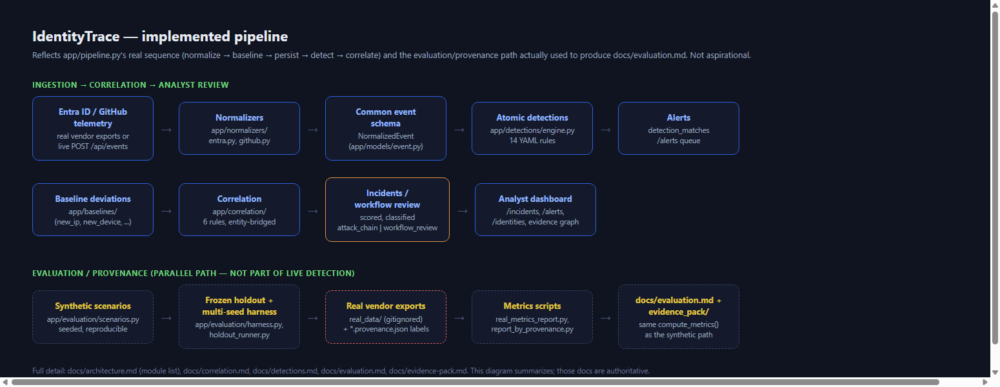
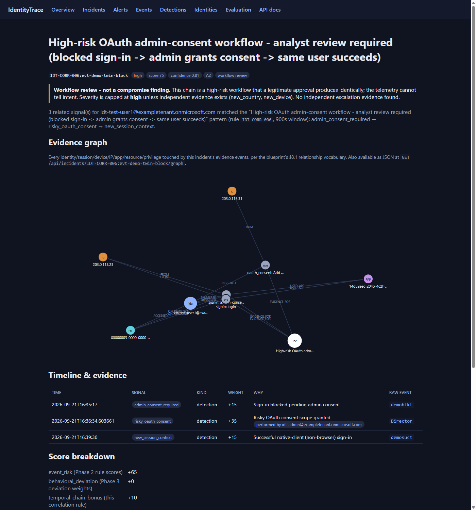

# IdentityTrace

Cross-SaaS identity attack detection platform (blue-team research/portfolio
project). Normalizes authentication, OAuth, developer-platform, privilege,
and data-access telemetry into one schema and correlates it into
evidence-backed incidents.

**Release status: v1.3 portfolio pilot.** The Azure pilot was demonstrated on
2026-09-29 and removed at the owner's request on 2026-09-30; resource-group
deletion was verified on 2026-10-01. There is no hosted demo currently.
Run the application locally with the instructions below.

### What has been verified

| Exercise | Recorded result | Limit |
|---|---|---|
| Live Azure workflow | Four synthetic events stored; one expected three-event incident; no duplicate on replay; notes and Word export persisted | Functional demonstration, not independent accuracy evidence |
| Local PostgreSQL/TLS lab | 300/300 requests; 300 events; 100 incidents; native backup/restore fingerprints matched | Short lab run, not sustained cloud capacity or recovery validation |
| Earlier controlled real-telemetry study | Redacted Entra and GitHub evidence and metrics retained below | Small corpus; GitHub observability incomplete; benign consent can resemble an attack |

See [live workflow evidence](evidence_pack/azure-live-workflow-20260929.json),
[local lab evidence](evidence_pack/production-lab-v1.3-final.json), and
[release notes](docs/release-v1.3.md). Continuous vendor-log collection is not
configured by installing the app. The repository includes manual collection/import
scripts; they require the operator's own accounts, permissions, and configuration.
The engine uses rules and behavioral baselines, not a trained machine-learning model.

## Version 1.3 improvements

- Built-in browser sign-in with authorization code + PKCE, expiring server-side
  sessions, local logout and HTTPS enforcement. See [Entra setup](docs/entra-setup.md).
- Customer deployment generator with separate networks, volumes and credentials;
  PostgreSQL is persistently bound to its owning organization.
- A repeatable PostgreSQL/TLS lab tests concurrent ingestion, cross-customer denial
  and native backup/restore with all-table fingerprints. Recorded local results:
  300/300 successful requests, 300 events and 100 incidents. This is a short lab
  exercise, not a production capacity or availability commitment.
- [External telemetry evaluation](docs/independent-evaluation.md) keeps annotations
  out of the detector, validates frozen inputs and reports unknown cases separately.
  No new independently labeled corpus has been verified in this upgrade.

### Included from version 1.2

- Word incident reports and filtered summary reports with plain tables, evidence
  fingerprints, audited downloads, and CSV export. Open `/incidents` to download.
- Shared queue/API/export filters; analyst edits can reject stale updates with HTTP 409.
- Organization-scoped OIDC access-token verification, explicit role mapping and
  production safeguards. One deployment and database per organization.
- Readiness checks, structured request logs, request IDs, admin-only Prometheus metrics,
  file-mounted database secrets, hardened containers and a verified SQLite backup tool.
- Workflow confusion counts and Wilson intervals, reproducible dataset/rule/code hashes,
  and a multi-seed benchmark CLI. Synthetic scores remain research evidence, not proof
  of enterprise detection performance.

See [the operations guide](docs/operations.md) for exact configuration, migration,
backup/recovery instructions and deployment limitations. Browser SSO requires your
Entra registrations and HTTPS deployment. No cloud infrastructure is provisioned
automatically. Shared-database multi-tenancy is not supported.

**Current status: research implementation with deployment safeguards and
measured limitations.** The evaluation includes noisy benign personas, a frozen out-of-sample holdout set,
multi-seed statistics, F1/false-positive-rate reporting, a standalone
atomic-alerts queue alongside incidents, and the real-vendor-telemetry
ingestion path - since exercised against a real Microsoft 365 developer
tenant and real GitHub personal security-log exports (see [`docs/evaluation.md`](docs/evaluation.md)'s
real-data sections and the [Evidence & results](#evidence--results) below;
[`docs/phase9-external-evaluation.md`](docs/phase9-external-evaluation.md)
covers the original infrastructure work).
See [`docs/architecture.md`](docs/architecture.md) for the full module
map, [`docs/evaluation.md`](docs/evaluation.md) for what all of that
actually found, and the blueprint
([`docs/blueprint.pdf`](docs/blueprint.pdf)) for the complete design this
project builds against.

## What's working right now

- A normalized event schema (`app/models/event.py`) covering identity,
  auth, OAuth, session/device, and data-access fields.
- Normalizers that translate Entra-, GitHub-, and M365-shaped raw audit
  payloads into that schema (`app/normalizers/`) - the third source
  (Phase 6) required zero changes anywhere else in the app, see
  [`docs/cross-domain.md`](docs/cross-domain.md).
- A FastAPI ingestion/query API under `/api` (`POST /api/events`,
  `GET /api/events`, `GET /api/events/{id}`) backed by SQLAlchemy (SQLite by
  default, Postgres via `DATABASE_URL`).
- 14 versioned atomic detection rules (`detections/`), evaluated against
  every ingested event, covering all six attack scenarios (A1-A6). See
  [`docs/detections.md`](docs/detections.md). Results: `GET /api/detections`
  (rule library), `GET /api/matches[/{id}]`, `GET /api/events/{id}/matches`.
- Per-identity behavioral baselines - known devices/IPs/countries/apps/
  auth-protocols/login-hours/volume, and deviation flags (new device, new
  country, unusual hour, volume anomaly, ...) evaluated against each
  identity's history at ingestion time. See
  [`docs/baselines.md`](docs/baselines.md). Results:
  `GET /api/identities[/{actor_id}]`, `GET /api/events/{id}/deviations`.
- **Temporal correlation into incidents** - 6 correlation rules chain
  detection matches and baseline deviations, in order, within a time
  window, into a scored incident with a fully explainable score and
  confidence breakdown. Five chain signals for one identity; one
  (`IDT-CORR-006`) is *entity-bridged* - it lets an admin's consent step
  sit between a user's blocked and successful sign-ins, linked only by an
  exact shared service principal, and is classified `workflow_review`: a legitimate
  admin approval produces the same chain, so it is surfaced for analyst review with
  severity capped at `high` unless independent evidence exists, never asserted as
  compromise. Analyst disposition (status/notes)
  survives re-correlation. See [`docs/correlation.md`](docs/correlation.md).
  Results: `GET /api/incidents[/{id}]`, `PATCH /api/incidents/{id}`,
  `GET /api/events/{id}/incidents`, `GET /api/correlation-rules`.
- **Identity graph** - each incident's evidence rendered as typed
  entities/relationships (identity, session, device, IP, OAuth app,
  permission, resource, privilege) per the blueprint's §8.1 vocabulary,
  built on demand with NetworkX (no persisted graph to keep in sync). See
  [`docs/graph.md`](docs/graph.md). `GET /api/incidents/{id}/graph`, and
  rendered inline as SVG on the incident detail page.
- **Evaluation harness** - a fixed-seed, labeled benign+attack dataset
  (all six scenarios) run through the exact same pipeline the live app
  uses, against a throwaway in-memory database that can never touch real
  data. Reports precision/recall/false-positive-rate/latency/alert-
  reduction, comparing the correlation engine against an isolated-rule
  baseline - the project's core research question, answered with numbers
  instead of an assertion. See [`docs/evaluation.md`](docs/evaluation.md).
  `POST /api/evaluation/run`, dashboard: `/evaluation`.
- A server-rendered dashboard (`/` overview, `/incidents[/{id}]` queue +
  detail with an evidence graph and a disposition form, `/events` list,
  `/rules` detection library, `/identities[/{id}]` profile pages,
  `/evaluation` metrics) - deliberately on separate paths from the JSON
  API, see `app/main.py`'s docstring for why.
- An extensive unit + integration test suite with measured coverage: schema validation,
  all three normalizers, the detection engine and all 14 rules (positive +
  negative cases each), the baseline profile builder and deviation
  evaluator, the correlation engine/scoring, the identity graph builder/
  renderer, the evaluation harness's generators/metrics (including the
  frozen holdout set and multi-seed statistics), the demo-seed and
  real-export-ingestion scripts (run as real subprocesses), and a full
  ingest -> detect -> baseline -> correlate -> incident -> graph path with
  hand-verified score/confidence math.
- **Phase 9 evaluation hardening** - 6 noisy benign personas + 4 ambiguous
  singletons (an isolated new-device/OAuth-consent/repo-access/bulk-
  download signal each), which is what makes the correlation-vs-isolated
  comparison actually mean something: isolated-rule precision drops to
  0.596 under this realistic noise while correlation holds 1.0 on the
  identical dataset. Plus a frozen out-of-sample holdout set (including an
  attack combination none of the six correlation rules were written
  around - caught anyway), multi-seed mean±stdev reporting, F1 scores, and
  a standalone high-severity `/alerts` queue alongside `/incidents`. See
  [`docs/evaluation.md`](docs/evaluation.md) and
  [`docs/phase9-external-evaluation.md`](docs/phase9-external-evaluation.md).
- **Normalizer fidelity check** - every normalizer validated against
  fixtures shaped like each source's real, officially-published API
  schema (Microsoft Graph, GitHub's audit log, the O365 Management
  Activity API), not just this project's own invented shapes. Found and
  fixed 4 real bugs, including a dispatch-logic collision that would have
  crashed on a genuine Entra audit payload. See
  [`docs/normalizer-fidelity.md`](docs/normalizer-fidelity.md) for what
  was checked, what broke, and why full Splunk BOTS integration (the
  blueprint's own dataset recommendation) wasn't feasible here.
- **CI** (`.github/workflows/ci.yml`) - lint, the full test suite with a
  90% coverage floor, and a Docker build-and-boot smoke test, on every
  push/PR.
- **Docker**: `docker compose up --build` runs Postgres and the app
  together end-to-end (see `Dockerfile`, `docker-compose.yml`). Not
  verified with an actual `docker build` in this project's own dev
  environment (Docker isn't installed there) - the configured CI job
  exercises it, and a real packaging bug in the detection/correlation
  rule-loading path was caught and fixed while writing it (see
  [`docs/architecture.md`](docs/architecture.md)'s Phase 8 section).
- **`scripts/seed_demo_data.py`** - populates the app's real database
  with the same reproducible dataset the evaluation harness generates,
  so a fresh clone has real incidents to explore immediately.
- **[`docs/case-studies.md`](docs/case-studies.md)** - two full
  investigation walkthroughs (A2, A4) using real, unedited system output.

## Evidence & results



Real Microsoft 365 tenant + real GitHub personal security-log telemetry, captured end-to-end
through the live pipeline (screenshots below have every identifier -
tenant domain, IPs, service-principal/object IDs - replaced with stable
placeholders; nothing else is edited - see
[`docs/evidence-pack.md`](docs/evidence-pack.md)):

| Real A2 workflow | Benign twin (same rule, same score) |
|---|---|
|  |  |

Same rule (`IDT-CORR-006`), same three-step chain, same score (`75 / high`)
for both a real attack sequence and a real legitimate admin approval - the
finding the rule is now classified around: it detects the *workflow*, not
intent. See [`docs/evaluation.md`](docs/evaluation.md), "A2 Benign Twin —
Detection vs Intent", for the full analysis, and
[`docs/evidence/raw-to-detection-proof.md`](docs/evidence/raw-to-detection-proof.md)
for one real event traced raw -> normalized -> detected end to end.

More: [atomic alert queue](docs/evidence/03-real-atomic-alerts.png) ·
[final real-data metrics](docs/evidence/04-final-real-metrics.png) ·
[provenance breakdown](docs/evidence/05-provenance-breakdown.png) ·
[tests & lint](docs/evidence/06-tests-and-lint.png)

**Headline numbers** (real data, `scripts/real_metrics_report.py`; full
detail and every caveat in [`docs/evaluation.md`](docs/evaluation.md)):

| | Isolated rules | Correlation |
|---|---|---|
| Recall (attack-export denominator) | 1.000 (7/7) | 0.286 (2/7) |
| Precision | 0.575 | 0.500 |
| False-positive rate | 0.081 | 0.143 |

The two correlated attack exports belong to one of three A2 attempts.
The real-data 20.0 alert/incident ratio is not evidence of useful noise
reduction; GitHub observability is incomplete.

Correlation precision of 0.500 is **not hidden** - it's the benign twin
above, kept as evidence that a correlation rule can detect a workflow
without being able to infer intent. Machine-readable versions of all of
this: [`evidence_pack/`](evidence_pack/) (raw redacted vendor events,
IdentityTrace's own processing/detection output, and the evaluation
results, kept as three separate tiers).

## v1.0 dataset and limitations

v1.0 evaluates real Entra and real GitHub telemetry separately from the
synthetic benchmark and frozen synthetic holdout. The labeled real corpus
contains 238 events (213 Entra across four sparse calendar dates, 25 GitHub
on one date), including one benign A2 twin
and an 11-event revocation experiment. Seven attack-labeled export files
represent three A2 attempts and two A4 attempts, not seven independent
workflows. The evaluated provenance files define the corpus; other rows
in a local development database are not additional evaluation evidence.

- Real users, collection duration, and fully observed workflows are limited;
  the corpus is not a longitudinal enterprise sample.
- GitHub telemetry did not expose the full A4 chain, including the required
  clone/content-access evidence.
- Sparse baseline history limits conclusions about behavioral deviations.
- Workflow detection does not establish malicious intent: the benign twin
  and controlled A2 workflow both produce the same review finding.
- These results should not be generalized across enterprises. A6 remains
  undetected by correlation in the frozen holdout, though atomic rules fire.

No public external dataset was integrated: the candidates considered did
not provide a sufficiently clean, practical fit to the core identity/SaaS
logic. LANL authentication could at most provide a narrow device-baseline
check; it was not downloaded or integrated. These are accepted v1.0 limits.

### Possible v1.1 work

Future work may include 7-14 days of Entra collection, more identities,
repeated controlled A2 and benign-twin workflows, richer baseline
validation, and more GitHub activity if suitable telemetry becomes
available. None is required to complete v1.0.

See the [final release review](docs/release-readiness-v1.0.md) for verified
results, the release file manifest, and manual commit/tag instructions.

## Quick start

The quick start below uses an explicitly enabled, loopback-only demo mode.
Production mode requires organization-scoped OIDC, HTTPS, and a dedicated
PostgreSQL database bound to that organization. Docker Compose binds published
ports to `127.0.0.1`. See the operations guide for authenticated deployments.

### Ingestion guarantees

- Event IDs are immutable: identical normalized retries are accepted;
  reusing an ID with different content returns HTTP `409` and preserves
  the original evidence. Replays are not a rule-reprocessing mechanism.
- Events, detection matches, deviations, and correlated incidents commit
  together. A processing failure rolls the transaction back.
- Correlation rechecks later stored signals when an earlier event arrives,
  while still enforcing each rule's original time window.
- Late events rebuild baseline and incident evidence for the affected identity.
  Findings no longer supported are marked superseded; analyst notes are preserved.
- Interactive evaluation accepts 1-10 instances per scenario and 1-20
  benign identities through the API (the dashboard exposes the scenario
  limit). A per-process semaphore permits one interactive evaluation at a time.

```bash
cd identitytrace
python -m venv .venv
. .venv/Scripts/activate        # Windows PowerShell: .venv\Scripts\Activate.ps1
pip install -e ".[dev]"

pytest                          # run the test suite

python scripts/seed_demo_data.py  # optional: populate synthetic incidents to explore

# Loopback-only demo. PowerShell: $env:IDENTITYTRACE_DEMO_MODE = '1'
export IDENTITYTRACE_DEMO_MODE=1
uvicorn app.main:app --reload --no-access-log
```

For Docker, first configure the credential and database secret files and run the
migration steps in [the operations guide](docs/operations.md). Then:

```bash
docker compose up --build
# then, in another terminal, optionally: docker compose exec app python scripts/seed_demo_data.py
```

Then, with the server running:

```bash
curl http://127.0.0.1:8000/health

curl -X POST http://127.0.0.1:8000/api/events \
  -H "Content-Type: application/json" \
  -d '{"source":"entra","raw":{"id":"signin-1","createdDateTime":"2026-09-09T17:02:11Z","userPrincipalName":"alice@example.test","appId":"app-123","ipAddress":"203.0.113.25","status":{"errorCode":0},"authenticationProtocol":"deviceCode"}}'
# -> normalized event; query /api/matches to inspect rule results

curl http://127.0.0.1:8000/api/events
curl http://127.0.0.1:8000/api/detections           # the 14-rule library
curl http://127.0.0.1:8000/api/matches              # everything that's fired so far
curl http://127.0.0.1:8000/api/identities/alice@example.test  # her baseline
curl http://127.0.0.1:8000/api/incidents             # correlated incidents, if any chain completed
curl http://127.0.0.1:8000/api/incidents/{id}/graph   # that incident's evidence graph as JSON
curl -X POST http://127.0.0.1:8000/api/evaluation/run -d '{}' -H "Content-Type: application/json"
# -> precision/recall/FPR/latency for isolated rules vs. the correlation engine
```

Or open http://127.0.0.1:8000/ for the dashboard (`/incidents` for the
queue and per-incident evidence/scoring/disposition, `/events` for the
event list with per-event detections/deviations, `/rules` for the
detection library, `/identities` for behavioral baselines, `/evaluation`
for the precision/recall/FPR report), or
http://127.0.0.1:8000/docs for interactive API docs.

Data lives in a local `identitytrace.db` SQLite file by default
(gitignored). To use Postgres without the full `docker compose up`
(e.g. you're running the app itself outside Docker): `docker compose up
-d postgres`, then set `DATABASE_URL` per `.env.example` - no code
changes required.

## Project layout

See [`docs/architecture.md`](docs/architecture.md) for a diagram and
module map, [`docs/threat-model.md`](docs/threat-model.md) for the attack
scenario catalog (A1-A6) this project targets, and
[`docs/case-studies.md`](docs/case-studies.md) for two real incidents
walked through end to end.

## Ethics & safe testing

This is a defensive research/lab project. The attack scenario generators
(`app/evaluation/scenarios.py`) run only against synthetic fixtures in a
throwaway in-memory database - never real accounts, real tenants, or
third-party systems. See blueprint §13 for the full policy.
